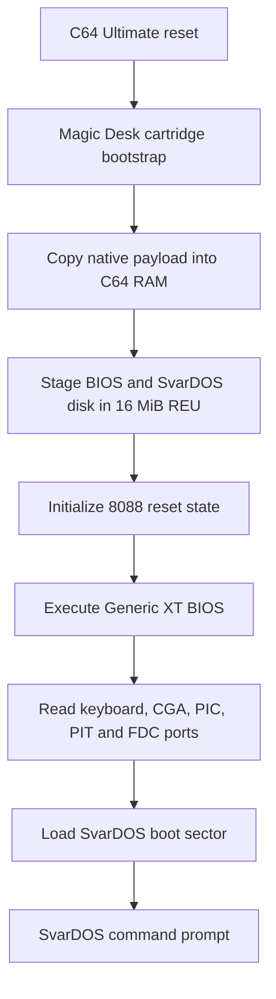
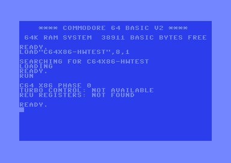
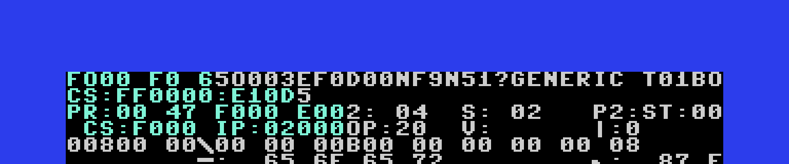
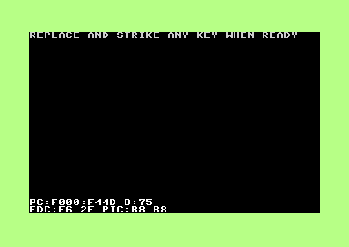

# C64 x86

An experimental **Intel 8088 emulator** running natively on [Commodore 64 Ultimate](<https://c64ultimate.com/> - <https://www.commodore.net>) hardware in Turbo Mode — because why not?

This project is a retro-computing experiment inspired by the spirit of pushing vintage machines beyond their intended boundaries. It simulates an Intel 8088 CPU (the heart of the original IBM PC) directly on a MOS 6502-based platform, targeting a SvarDOS boot through the C64U's REU memory expansion.

No FPGAs. No external processors. Just pure 6502 assembly squeezing out x86 semantics one cycle at a time.

This emulator boots svardos but it takes ages, and desperately needs optimization. Join. fork, do whatever you want - just keep in mind this is a GNU GPL3.0 Open Source project so please reshare again.

For an exact implementation checkpoint and step-by-step continuation handoff,
see [`CONTINUATION.md`](CONTINUATION.md).

The project has entered the native BIOS integration phase. The current target
program validates the host features and then runs the Generic XT reset vector:

- software-controlled C64U turbo mode;
- REU register presence;
- a non-destructive 16 MiB REU capacity probe;
- guarded C64-to-REU and REU-to-C64 block transfers;
- the 8088 register block, PC/XT reset state, and 20-bit segmented addressing;
- manifest-verified BIOS placement into REU guest memory;
- a bounded native BIOS execution loop with C64 keyboard polling and CGA
  refreshes.

The current milestone is native BIOS execution with SvarDOS 360 KiB media.

## Build requirements

- cc65, including `ca65` and `ld65`
- GNU Make, or PowerShell on Windows
- Python 3 for host-side tests

On Windows, install the portable project-local cc65 toolchain with:

```powershell
./tools/bootstrap_cc65.ps1
```

It is unpacked under `.cache/cc65`, which is ignored by Git. `build.ps1`
automatically uses this copy when cc65 is not available on `PATH`.

Build with either:

```sh
make
```

or:

```powershell
./build.ps1
```

The output is `build/c64x86-hwtest.prg`.

Build the required autostart cartridge executable with:

```powershell
./build_crt.ps1
```

## Boot path



## VICE milestones

The checked-in captures record the current desktop milestones. They are
diagnostic evidence, not a claim that the final SvarDOS prompt is complete.



*C64 cartridge diagnostic starts and reaches the host checks.*



*The native 8088 reaches the Generic Turbo XT BIOS banner.*



*The BIOS/FDC diagnostic trace is visible while floppy initialization is under test.*

## Current 8088 execution subset

The native stepper currently covers the following groups:

| Area | Supported instructions and behavior |
| --- | --- |
| Core | `NOP`, `HLT`, register/memory `MOV`, direct-offset `A0`-`A3`, and all ModR/M effective-address forms with correct DS/SS defaults. |
| ALU | `ADD`, `OR`, `ADC`, `SBB`, `AND`, `SUB`, `XOR`, `CMP`, `TEST`, `CMC`, `DAA`, `INC`, `DEC`, `NOT`, `MUL`, `IMUL`, `DIV`, `IDIV`, and Group-1 immediate arithmetic. Byte and word register/memory forms share the native 8088 flag engine. |
| Shifts | `SHL`/`SAL`, `SHR`, and `SAR` with immediate-one or unmasked `CL` counts, including 8088 flag behavior and zero-count handling. |
| Control flow | Relative and indirect near `JMP`/`CALL`, far immediate `JMP`/`CALL`, `RET`/`RETF` (with optional immediates), all short conditional branches, `LOOPNE`, `LOOPE`, `LOOP`, and `JCXZ`. |
| Stack and segments | Register and segment `PUSH`/`POP`, `PUSHF`/`POPF`, `SAHF`/`LAHF`, `LES`, `LDS`, and REU-backed SS:SP accesses. Loading SS applies the 8088 interrupt shadow. |
| Strings and prefixes | ES/CS/SS/DS overrides; `MOVS`, `CMPS`, `STOS`, `LODS`, and `SCAS` with direction-flag updates, zero-count handling, and `REPE`/`REPNE` stopping rules. |
| Interrupts | `INT3`, `INT imm8`, `INTO`, `IRET`, PIC IRQ delivery, `STI`/`CLI` interrupt masking, the one-instruction `STI` shadow, halted-guest wakeup, and an IF-independent NMI latch. |
| I/O and XT devices | Immediate- and DX-addressed byte `IN`/`OUT`, open-port `$FF`, POST/debug latches at `$80`/`$81`, CGA status at `03DAh`, XT PPI switch bank at `60h`-`62h`, and keyboard input through port `60h` with IRQ 09h. |
| Runtime | 256-byte write-back data pages with instruction-cache coherence, explicit REU flushes, and REU-backed instruction fetch. The byte-at-a-time fetch path remains available for bootstrap diagnostics. |

The desktop BIOS path displays the Generic Turbo XT banner in the emulated
`B8000` 80x25 text page before waiting for keyboard input.

The canonical register layout, flag masks, and implemented opcode metadata are
in `config/cpu8088.json`. Regenerate the assembly contract and native smoke
vector after changing that specification or its JSON vectors:

```sh
python tools/generate_cpu8088.py
```

Run the deterministic desktop reference model and print its instruction traces
with:

```sh
python tools/ref8088/runner.py tests/vectors/cpu8088_smoke.json --json
```

The same `native_smoke` vector generates the byte stream and expected register
values consumed by the cartridge diagnostic, preventing the desktop and native
tests from silently drifting apart.

For independent semantic comparison, install the pinned Unicorn x86 engine
into the ignored project cache and run the differential oracle:

```powershell
./tools/bootstrap_test_deps.ps1
python ./tools/ref8088/unicorn_oracle.py ./tests/vectors/cpu8088_smoke.json
```

Unicorn comparison covers architectural state and memory effects. Instruction
cycle metadata remains an 8088-specific contract informed by PCem's
`src/cpu/808x.c`, because Unicorn does not model 8088 bus timing.

The desktop oracle additionally covers 16-bit register `INC`/`DEC`,
`PUSH`/`POP`, near relative `CALL`, near `RET`, and the complete `Jcc` condition
decoder. These handlers are validated in the reference model before entering
the size-constrained native assembly dispatch.

Prefix-aware reference execution supports ES/CS/SS/DS segment overrides,
`REP`/`REPE`/`REPNE`, and byte/word `MOVS`, `CMPS`, `STOS`, `LODS`, and `SCAS`.
The Unicorn adapter accounts for its one-iteration-at-a-time REP stepping so
the comparison still covers the complete architectural instruction.
The reference core also covers unsigned/signed byte and word division,
including divide-by-zero and quotient-overflow interrupt 0. Its oracle adapter
preserves the original 8088 rule that the saved return IP follows the `DIV` or
`IDIV`; later x86 generations report the faulting instruction instead.

## PCem reference checkout

PCem is reference material and is not linked into the target program. Fetch the
pinned revision with:

```powershell
./tools/fetch_pcem.ps1
```

The checkout lives at `third_party/pcem` and is ignored by this repository.

Fetch and validate the user-requested development ROM collection with:

```powershell
./tools/fetch_roms.ps1
python ./tools/verify_roms.py
```

The ROM checkout is also ignored. Its upstream repository has no license file,
so ROM binaries must not be committed or packaged with releases.

Create a raw 1 MiB REU guest-memory image with the selected BIOS mapped into
place:

```sh
python tools/build_guest_image.py --profile genxt
```

This writes `build/guest-genxt.reu`, which is ignored because it contains the
locally acquired ROM. It can be preloaded at REU address zero for bootstrap
testing.

## SvarDOS boot media

The default XT boot target is the raw SvarDOS 360 KiB disk image at
`third_party/svardos/svdos-360K-disk-1.img`. Build the cartridge with:

```powershell
./build_crt.ps1
```

The image uses 512-byte sectors, 9 sectors per track, 2 heads, and 40
cylinders. The builder writes the matching geometry into the native FDC
configuration and packages the disk into the CRT banks.

## Host tests

```sh
python -m unittest discover -s tests -v
```
